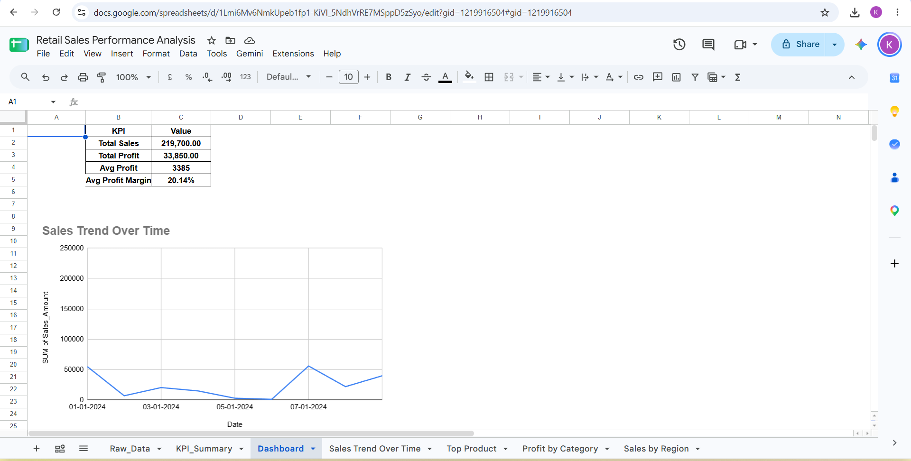

# Retail Sales Performance Analysis

End-to-end sales analytics and KPI dashboard built using Google Sheets.

Click here to view live google sheet project 
https://docs.google.com/spreadsheets/d/1Lmi6Mv6NmkUpeb1fp1-KiVI_5NdhVrRE7MSppD5zSyo/edit?usp=drivesdk

## 📊 Dashboard Preview

## 📌 Project Overview
- Analyzed product sales, profit margins, and order volume across regions.
- Tracked key metrics including total sales amount, quantity sold, and average profit.
- Visualized monthly trends and product category distribution.

## 🛠️ Tools & Skills
- Google Sheets / Excel
- KPI Cards & Pivot Tables
- Data Cleaning & Categorization
- Trend Visualizations
